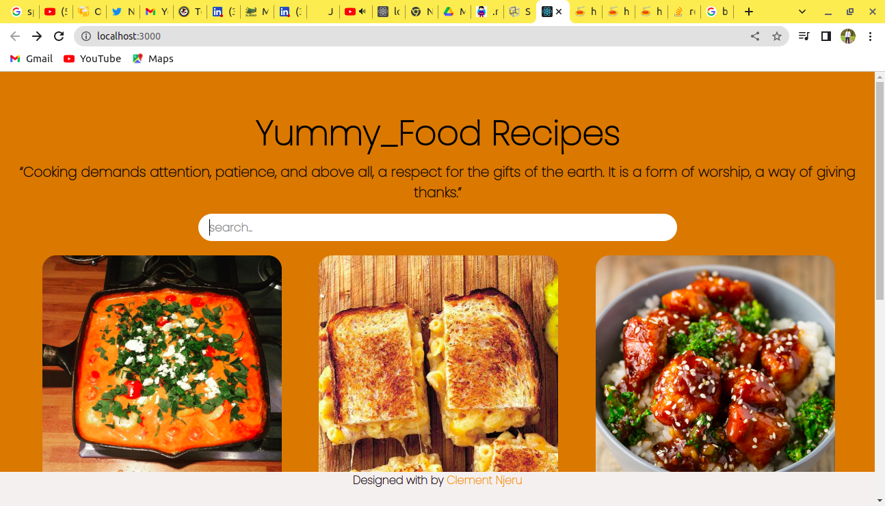
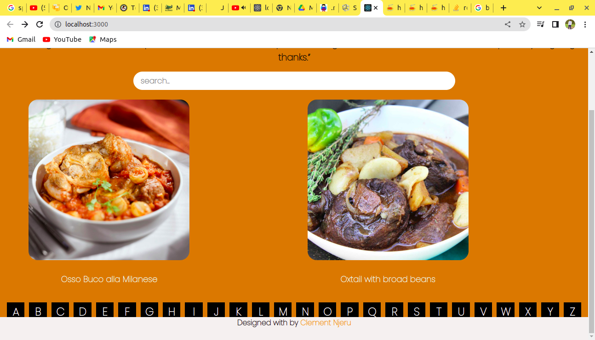

# Yummy_Recipes 
***
### Author : Clement Njeru © 2022
**
## Project Description
This is a platform that allows individuals from all over the world to navigate through in order to get various Recipes of various dishes and the ingridients used to prepare them. It is formated with a friendly navigation procedures which will allow the users to check out their favorite meals recipes without having any troubles.
**

## Screenshots
 
 
 
 

<!-- @@ -33,7 +33,7 @@ This is a platform that allows people working from home to navigate through the
Use Live share extension to run the HTML File. -->
***
## Live Link
Or you can access the web application directly via this https://clementnjeru.github.io/Yummy_Recipes/
***

## Technologies Used
1. HTML
2. CSS
3. ReactJs
***
## Contact Information
Authors Info Slack Profile - [Clement Njeru] 
Email - [njeruclement36@gmail.com], [clement.kemaro@student.moringaschool.com]
LinkedIn Profile - [Clement Njeru]
***
## LICENSE
MIT License
Copyright (c) 2022 Clement Njeru